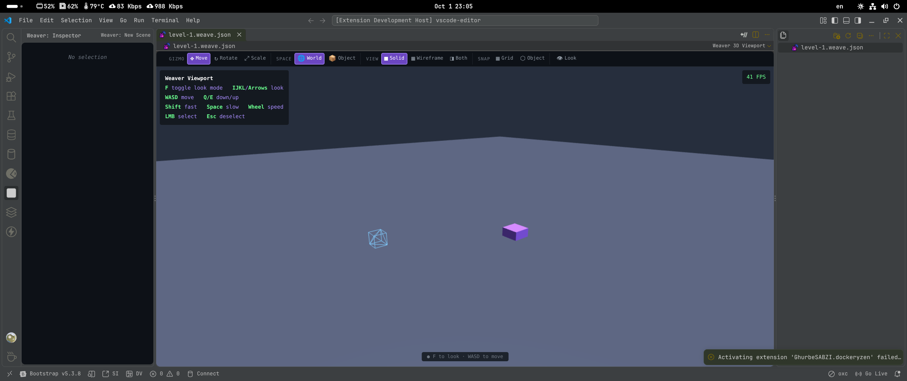

# 🛡️ Weaver

> **3D game editor from TS/JS for 💠 VSCode.**

  <table>
    <tr>
      <td align="center" style="background: linear-gradient(135deg, #667eea 0%, #764ba2 100%); padding: 20px; border-radius: 12px;">
        <h3 style="color: white; margin: 0;">🛡️ 3D game editor from TS/JS for 💠 VSCode.</h3>
      </td>
    </tr>
  </table>

  

